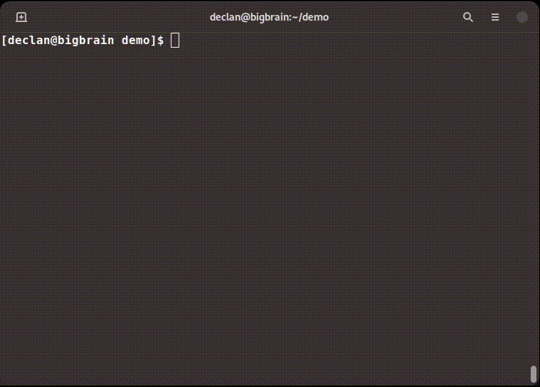

# Chlorine
Simple Password Based File Encryption Tool written in Rust.



Cryptography
---
All Cryptography methods in this tool are provided by [libsodium](https://github.com/jedisct1/libsodium) and its Rust bindings provided by [Sodium Oxide](https://github.com/sodiumoxide/sodiumoxide).

#### Files
Files are encrypted using **ChaCha20** with a **Poly1305 MAC**, upon encrypting a randomly generated salt is prepended to the 
cipher text.

#### Key Derivation
Key's are derived from the user supplied password using a particular combination of **Scrypt**, **Salsa20/8** and **SHA-256**

Releases
---
Compiled and ready to run binaries can be found in the [Releases](https://github.com/notdeclan/chlorine/releases) page 

Compilation Instructions
---
```
$ git clone https://github.com/notdeclan/chlorine && cd chlorine
$ cargo build
$ cargo build --release
```

### Future Work
- Folder Encryption
- Compression
- Progress Bar and percentage status    
